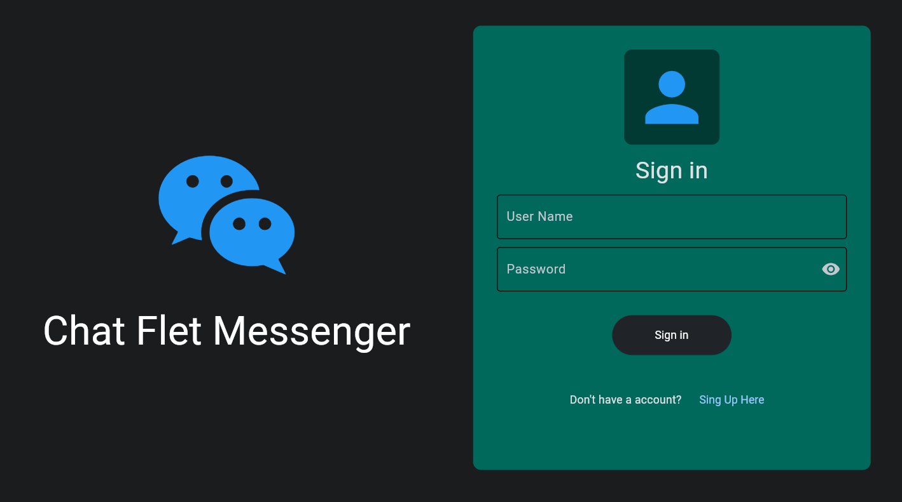
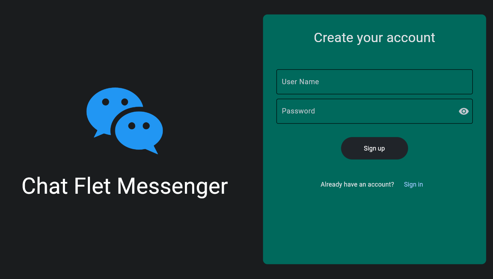
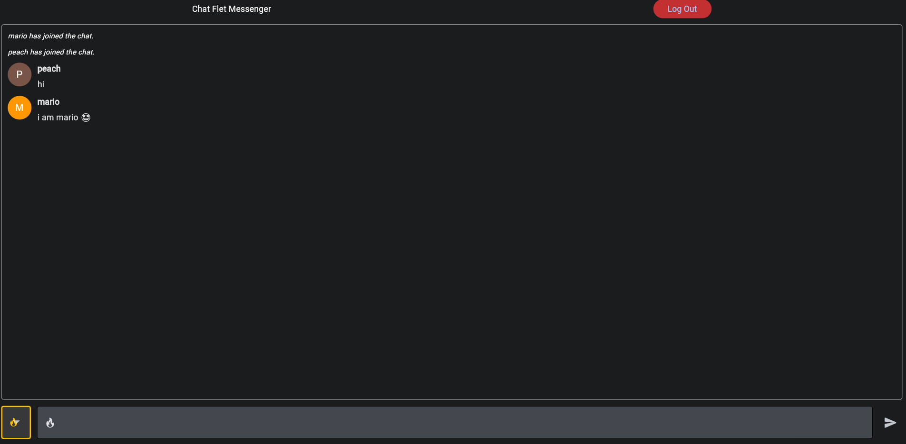

# Realtime-Chat-App
Realtime chat app in Python

### Install All Packages from a requirements.txt File Using pip and Python:

<code>pip install -r requirements.txt</code>

#### Run app:
<code>python main.py</code>

#### ScreenShots:

